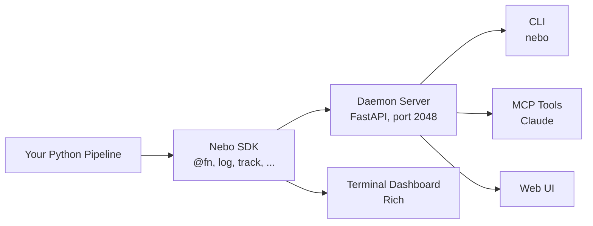

# Nebo

Nebo is a modern logging SDK for multi-modal data. Decorate your functions with `@nb.fn()` and call `nb.log()` to write logs; nebo automatically infers a DAG from your call graph.

## Why Nebo?

Nebo offers function-level logging capturing metrics, images, audio, and text at the granularity of individual functions, so you can monitor inputs, outputs, and execution flow of your code. Global logs, or logs not bound to a particular function, are also supported. This enables observability for applications such as:
* Agentic workflows with multimodal data
* DAG-structured data-processing pipelines
* ML training + inference

## Features

* Captured log types: text, metrics, images, audio, progress
* Automatically infers a DAG from your call graph
* CLI, MCP and agent skill for AI agent query support
* Fully self-contained log file per run
* Rich terminal UI
* Mobile-first web UI

Nebo is in active development and features will roll out according to its [core principles](https://docs.graphbook.ai).

## Installation

```bash
pip install nebo
```

The CLI entry point is `nebo`:

```bash
nebo --help
```

## Quick Start

```python
import nebo as nb

@nb.fn()
def load_data(path: str = "data.csv") -> list[dict]:
    """Load records from a file."""
    records = [{"id": i, "value": i * 0.5} for i in range(100)]
    nb.log(f"Loaded {len(records)} records from {path}")
    return records

@nb.fn()
def transform(records: list[dict]) -> list[dict]:
    """Normalize values."""
    out = []
    for r in nb.track(records, name="transforming"):
        out.append({**r, "value": r["value"] / 50.0})
    nb.log(f"Transformed {len(out)} records")
    nb.log_metric("record_count", float(len(out)))
    return out

def run():
    """Main pipeline entry point."""
    records = load_data()
    result = transform(records)
    return result

if __name__ == "__main__":
    run()
```

Running this produces a Rich terminal display showing the DAG, node execution counts, logs, and progress bars. The DAG edges (`run -> load_data`, `load_data -> transform`) are inferred automatically from data flow -- no manual wiring required.

## Core Concepts

### `@nb.fn()` -- Register a function as a DAG node

Every function decorated with `@nb.fn()` becomes a node in the pipeline DAG. Edges are inferred from **data flow**: when a node's return value is passed as an argument to another node, an edge is created from the producer to the consumer.

```python
@nb.fn()
def load_data():
    return [1, 2, 3]

@nb.fn()
def transform(data):
    return [x * 2 for x in data]

def run():
    records = load_data()        # edge: run -> load_data (no data dependency)
    result = transform(records)  # edge: load_data -> transform (data flows from load_data)
    return result
```

When a child node receives no node-produced arguments, the edge falls back to the calling parent node.

You can use it in several ways:

```python
@nb.fn              # bare decorator
@nb.fn()            # with parentheses
@nb.fn(depends_on=[other_fn])  # with explicit dependencies
@nb.fn(ui={"collapsed": True})  # with per-node UI hints
```

### Class Decoration

`@nb.fn()` can be applied to classes. All methods are wrapped with scope tracking, and the class name becomes a visual group in the DAG:

```python
@nb.fn()
class Agent:
    def think(self, query):
        nb.log(f"Thinking about: {query}")
        return {"plan": "respond"}

    def act(self, plan):
        nb.log(f"Acting on: {plan}")
        return "result"

agent = Agent()
agent.think("hello")
agent.act({"plan": "respond"})
```

Methods appear as `Agent.think` and `Agent.act` in the DAG, grouped under `Agent`.

### Automatic Materialization

Decorated functions appear in the DAG as soon as they execute for the first time — a call to `nb.log()`, `nb.log_metric()`, etc. is not required. This keeps dependency chains intact when an intermediate function only orchestrates calls to other nodes without logging anything itself.

### `depends_on` -- Explicit dependency declaration

Some dependencies cannot be detected automatically (shared mutable state, class attributes, global variables). Use `depends_on` to declare these explicitly:

```python
@nb.fn()
def setup():
    """Initialize shared resources."""
    ...

@nb.fn(depends_on=[setup])
def process():
    """Uses resources initialized by setup."""
    ...
```

### `nb.log(message)` -- Text logging

Log a message to the current node. Messages appear in the terminal dashboard and are queryable via MCP tools.

```python
@nb.fn()
def train(data):
    nb.log(f"Training on {len(data)} samples")
    for epoch in range(10):
        loss = do_train(data)
        nb.log(f"Epoch {epoch}: loss={loss:.4f}")
```

### `nb.log_metric(name, value, *, type="line", step=None, tags=None)` -- Metrics

Log metrics as line charts (default), bar charts, scatter plots, pie charts, or histograms. Type locks on first emission per `(loggable, name)` pair.

```python
@nb.fn()
def train(model, data):
    for epoch in range(100):
        loss = train_one_epoch(model, data)
        nb.log_metric("loss", loss)                           # line (scalar)
        nb.log_metric("counts", {"cat": 3, "dog": 5}, type="bar")
        nb.log_metric("lr", 3e-4, tags=["main"])              # tagged for UI filter
```

Value shape per type: `line` scalar; `bar`/`pie` `{label: number}`; `scatter` `{"x": [...], "y": [...]}` or list of `(x, y)`; `histogram` list of samples or `{"bins": [...], "counts": [...]}`.

### `nb.log_cfg(cfg)` -- Configuration logging

Log configuration for the current node.

```python
@nb.fn()
def train(lr=0.001, epochs=50):
    nb.log_cfg({"lr": lr, "epochs": epochs})
    ...
```

### `nb.track(iterable, name=None, total=None)` -- Progress tracking

Wrap any iterable for tqdm-like progress tracking.

```python
@nb.fn()
def process(items):
    for item in nb.track(items, name="processing"):
        transform(item)
```

### `nb.log_image(image, *, name=None, step=None, points=None, boxes=None, circles=None, polygons=None, bitmask=None)` -- Image logging

Log images (PIL, NumPy arrays, or PyTorch tensors) for visual inspection, with optional geometric labels overlaid. Points are `[x, y]` (or a list of them); boxes are `[x1, y1, x2, y2]` in xyxy format; circles are `[x, y, r]`; polygons are `[[x, y], ...]`; bitmasks are 2D (HxW) or stacked (NxHxW). The UI's Settings pane > "Image labels" section exposes per-(loggable, image, key) visibility and opacity controls.

### `nb.log_audio(audio, sr=16000, name=None, step=None)` -- Audio logging

Log audio data for playback and analysis.

### `nb.log_text(name, text)` -- Rich text / Markdown logging

Log formatted text or Markdown content.

### `nb.md(description)` -- Workflow description

Set a workflow-level description (Markdown supported). Visible in MCP tools and the dashboard.

```python
nb.md("A pipeline that loads images, runs inference, and exports predictions.")
```

### `nb.ui()` -- Run-level UI defaults

Set default layout and display options for the web UI:

```python
nb.ui(layout="horizontal", view="dag", minimap=True, theme="dark")
```

### `nb.ask(question, options=None, timeout=None)` -- Human-in-the-loop

Pause the pipeline and ask the user a question via MCP or the terminal.

```python
@nb.fn()
def review(predictions):
    answer = nb.ask(
        "Model accuracy is 73%. Continue training?",
        options=["yes", "no", "retrain with more data"]
    )
    if answer == "no":
        return predictions
    ...
```

## CLI Reference

### Start the daemon server

```bash
nebo serve                  # foreground
nebo serve -d               # background (daemon mode)
nebo serve --port 3000      # custom port
nebo serve --no-store       # disable .nebo file storage
```

### Run a pipeline

```bash
nebo run my_pipeline.py
nebo run my_pipeline.py --name "experiment-1"
```

### Load a .nebo file

```bash
nebo load .nebo/2026-04-06_143000_run-1.nebo
```

### Check status, logs, errors

```bash
nebo status
nebo logs
nebo logs --run experiment-1 --node train --limit 50
nebo errors
nebo errors --run experiment-1
```

### Stop the daemon

```bash
nebo stop
```

### MCP integration

```bash
nebo mcp   # print Claude Code MCP config
```

## MCP Tools for AI Agents

Nebo exposes 15 MCP tools for querying and controlling pipelines from an AI agent (e.g., Claude). The daemon server must be running.

### Observation Tools

| Tool | Description |
|------|-------------|
| `nebo_get_graph` | Full DAG structure: nodes, edges, execution counts |
| `nebo_get_node_status` | Detailed status for one node: logs, metrics, errors, params |
| `nebo_get_logs` | Recent log entries, filterable by node and run |
| `nebo_get_metrics` | Metric time series for a node |
| `nebo_get_errors` | All errors with full tracebacks and node context |
| `nebo_get_description` | Workflow description and all node docstrings |

### Action Tools

| Tool | Description |
|------|-------------|
| `nebo_run_pipeline` | Start a pipeline script, returns a run ID |
| `nebo_stop_pipeline` | Stop a running pipeline by run ID |
| `nebo_restart_pipeline` | Stop and re-run a pipeline with same args |
| `nebo_get_run_status` | Status of a specific run (running/completed/crashed) |
| `nebo_get_run_history` | List all runs with outcomes and timestamps |
| `nebo_get_source_code` | Read a pipeline source file |
| `nebo_write_source_code` | Write or patch a pipeline source file |
| `nebo_ask_user` | Send a question to the user via the terminal |
| `nebo_wait_for_event` | Block until a pipeline event occurs or timeout elapses |

## .nebo File Format

Runs are persisted as `.nebo` binary files using MessagePack serialization. Each file contains a header (magic, version, metadata) followed by append-only event entries. Use `nebo load` to replay a file into the daemon.

## Architecture



Two execution modes:

- **Local mode** (default): In-process only. No daemon needed.
- **Server mode**: Events stream to a persistent daemon via HTTP. Use `nebo serve` to start the daemon, then `nebo run` to execute pipelines.

## API Reference

### Module: `nebo`

| Function | Signature | Description |
|----------|-----------|-------------|
| `fn` | `@fn()`, `@fn(depends_on=[...])`, `@fn(ui={...})` | Register a function/class as a DAG node |
| `log` | `log(message: str)` | Log a text message |
| `log_metric` | `log_metric(name, value, *, type="line", step=None, tags=None)` | Log a metric (line/bar/scatter/pie/histogram) |
| `log_cfg` | `log_cfg(cfg: dict)` | Log node configuration |
| `log_image` | `log_image(image, *, name=None, step=None, points=None, boxes=None, circles=None, polygons=None, bitmask=None)` | Log an image (optionally with geometric labels) |
| `log_audio` | `log_audio(audio, sr=16000, name=None, step=None)` | Log audio data |
| `log_text` | `log_text(name, text)` | Log rich text / Markdown |
| `track` | `track(iterable, name=None, total=None)` | Progress tracking |
| `md` | `md(description: str)` | Set workflow description |
| `ui` | `ui(layout, view, collapsed, minimap, theme)` | Set run-level UI defaults |
| `init` | `init(port, host, mode, terminal, dag_strategy, flush_interval, store)` | Manual initialization |
| `ask` | `ask(question, options=None, timeout=None)` | Human-in-the-loop prompt |
| `get_state` | `get_state() -> SessionState` | Access the global state singleton |

