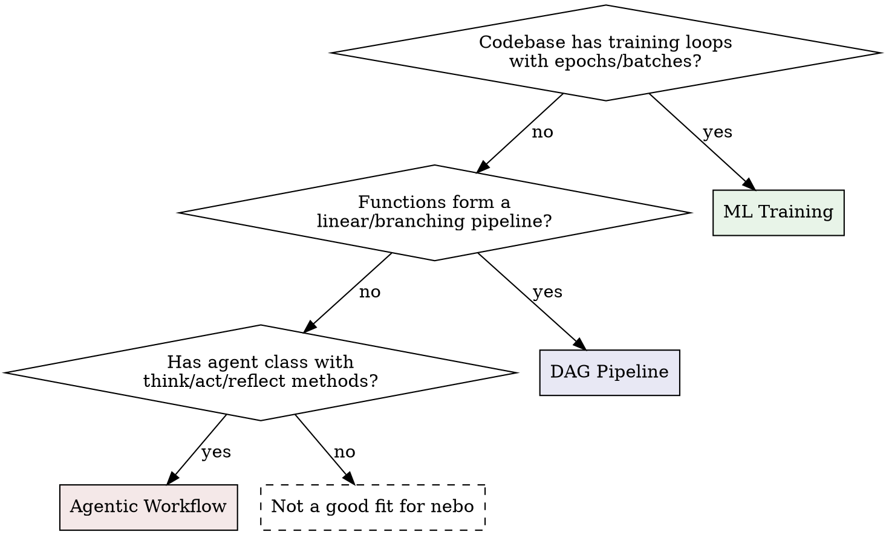

# Nebo

## Overview

Nebo is function-level logging for Python. You decorate functions with `@nb.fn()`, call `nb.log()` inside them, and nebo automatically infers a DAG from data flow, captures metrics, tracks progress, and exposes everything via MCP tools and a web UI.

**Core principle:** Decorate every meaningful step as `@nb.fn()`. Edges between nodes are inferred from data flow — no manual wiring. Call `nb.md()` and `nb.ui()` at module level before any decorated functions execute.

## Pattern Detection

Before integrating nebo, determine which pattern the codebase follows:



**Signals per pattern:**

| Signal | Pattern |
|--------|---------|
| Epoch loops, loss/accuracy, model weights, batch processing | ML Training |
| Sequential function calls, ETL, fan-out/fan-in, data transforms | DAG Pipeline |
| Class with methods like think/act/plan/reflect, agent loops, tool calls | Agentic Workflow |

## Pattern 1: ML Training / Inference

**When:** Training loops, hyperparameter sweeps, model evaluation.

```python
import nebo as nb

nb.md("Training a classifier on synthetic data.")
nb.ui(view="grid", layout="horizontal", tracker="step")

@nb.fn()
def create_dataset(n=1000):
    """Generate training data."""
    X, y = make_data(n)
    nb.log(f"Created dataset: {n} samples")
    return X, y

@nb.fn(pausable=True)
def train_step(model, batch_X, batch_y):
    """Single forward/backward pass. Pausable via web UI."""
    loss, acc = forward_backward(model, batch_X, batch_y)
    return float(loss), float(acc)

@nb.fn()
def train(dataset, model, epochs=100, lr=0.01):
    """Main training loop."""
    nb.log_cfg({"epochs": epochs, "lr": lr})
    X, y = dataset

    for epoch in nb.track(range(epochs), name="epochs"):
        loss, acc = train_step(model, X, y)
        nb.log_metric("loss", loss, step=epoch)
        nb.log_metric("accuracy", acc, step=epoch)

        if epoch % 10 == 0:
            nb.log(f"Epoch {epoch}: loss={loss:.4f}")
            img = visualize(model)
            nb.log_image(img, name="weights", step=epoch)

@nb.fn()
def run_experiment():
    dataset = create_dataset()
    model = create_model()
    train(dataset, model)
```

**Key APIs for ML:**
- `nb.log_metric(name, value, step=)` — loss, accuracy, lr curves
- `nb.log_image(img, step=)` — sample outputs, weight visualizations
- `nb.log_cfg(dict)` — hyperparameters shown in info tab
- `nb.track(range(epochs))` — epoch progress bar
- `@nb.fn(pausable=True)` — pause training from web UI
- `view="grid"` — grid view suits metric-heavy training with many nodes
- `tracker="step"` — scrubber tracks by step count, not wall time

**Multi-run for sweeps:**
```python
for cfg in [{"lr": 0.001}, {"lr": 0.01}, {"lr": 0.1}]:
    with nb.start_run(name=f"lr={cfg['lr']}", config=cfg):
        nb.log_cfg(cfg)
        run_experiment(lr=cfg["lr"])
```

## Pattern 2: DAG-Structured Pipeline

**When:** ETL, data processing, any sequence of transforms with branching.

```python
import nebo as nb

nb.md("""
# Data Processing Pipeline
Loads data, normalizes, filters, and generates a report.
""")
nb.ui(layout="horizontal", view="dag", minimap=True, tracker="step")

@nb.fn()
def load_data(path="data.csv"):
    """Load raw records."""
    records = read_csv(path)
    nb.log(f"Loaded {len(records)} records from {path}")
    return records

@nb.fn()
def normalize(records):
    """Normalize values to [0, 1]."""
    nb.log_cfg({"method": "minmax"})
    out = [normalize_record(r) for r in nb.track(records, name="normalizing")]
    nb.log_metric("record_count", float(len(out)))
    return out

@nb.fn()
def filter_outliers(records, threshold=3.0):
    """Remove statistical outliers."""
    nb.log_cfg({"threshold": threshold})
    filtered = [r for r in records if abs(r["value"]) < threshold]
    nb.log(f"Filtered: {len(records)} -> {len(filtered)}")
    return filtered

@nb.fn()
def generate_report(clean, raw):
    """Compare clean vs raw datasets."""
    nb.log_text("summary", f"**Clean:** {len(clean)} | **Raw:** {len(raw)}")
    return {"clean": len(clean), "raw": len(raw)}

@nb.fn()
def run_pipeline():
    raw = load_data()
    normed = normalize(raw)
    clean = filter_outliers(normed)
    return generate_report(clean, raw)  # fan-in: two data sources
```

**Key APIs for pipelines:**
- `nb.log_cfg(dict)` — per-step configuration in info tab
- `nb.log_text(name, markdown)` — rich markdown summaries
- `nb.track(items)` — progress bars on batch processing
- `nb.md(description)` — workflow-level description
- `minimap=True` — useful for wide pipelines

**DAG edges are automatic:** When `normalize(raw)` is called, nebo sees that `raw` came from `load_data()` and creates the edge `load_data -> normalize`.

## Pattern 3: Agentic Workflow

**When:** Agent class with multi-step reasoning, tool use, interactive decisions.

```python
import nebo as nb

nb.md("An agent that researches queries using think-act-reflect.")
nb.ui(view="dag", layout="vertical", tracker="step")

@nb.fn()
def fetch_context(query):
    """Retrieve relevant documents."""
    docs = search(query)
    nb.log(f"Found {len(docs)} documents")
    return docs

@nb.fn()
class Agent:
    """Multi-step reasoning agent."""

    def think(self, query, context):
        """Analyze query and form a plan."""
        nb.log(f"Thinking: {query}")
        nb.log_metric("context_docs", float(len(context)))
        return {"plan": f"Respond using {len(context)} docs"}

    def act(self, plan):
        """Execute the plan."""
        nb.log(f"Acting: {plan['plan']}")
        result = execute(plan)
        return result

    def reflect(self, query, response):
        """Evaluate response quality."""
        score = evaluate(response)
        nb.log_metric("quality_score", score)
        if score < 0.7:
            retry = nb.ask("Quality is low. Retry?", options=["yes", "no"])
            if retry == "yes":
                return None  # signal retry
        return {"score": score, "response": response}

def main():
    query = "What is nebo?"
    context = fetch_context(query)
    agent = Agent()
    plan = agent.think(query, context)
    response = agent.act(plan)
    result = agent.reflect(query, response)
```

**Key APIs for agents:**
- `@nb.fn()` on class — all methods auto-wrapped; methods appear as `Agent.think`, `Agent.act` etc. in the DAG, grouped under the class name
- `nb.ask(question, options=[...])` — pauses execution, returns the selected option as a string
- `nb.log_metric(name, value)` — per-action quality scores
- `view="grid"` — table view suits many small method calls
- `tracker="step"` — track by action count, not wall time

## API Quick Reference

| Function | Purpose |
|----------|---------|
| `@nb.fn()` | Register function/class as DAG node |
| `@nb.fn(depends_on=[f])` | Explicit edge when data flow can't infer |
| `@nb.fn(pausable=True)` | Allow pausing from web UI |
| `@nb.fn(ui={"collapsed": True})` | Per-node UI hints |
| `nb.log(message)` | Text log to current node |
| `nb.log_metric(name, value, step=)` | Scalar metric with optional step |
| `nb.log_cfg(dict)` | Configuration dict for info tab |
| `nb.log_image(img, name=, step=)` | PIL/numpy/torch image |
| `nb.log_audio(audio, sr=, name=, step=)` | Audio data |
| `nb.log_text(name, text)` | Rich markdown content |
| `nb.track(iterable, name=, total=)` | Progress bar |
| `nb.md(description)` | Workflow-level markdown |
| `nb.ui(layout=, view=, tracker=, ...)` | Run-level UI defaults |
| `nb.ask(question, options=, timeout=)` | Human-in-the-loop prompt |
| `nb.start_run(name=, config=, run_id=)` | Multi-run / resume support |
| `nb.init(mode=, dag_strategy=, ...)` | Manual initialization |

### `nb.ui()` Parameters

| Parameter | Values | Default | Notes |
|-----------|--------|---------|-------|
| `layout` | `"horizontal"`, `"vertical"` | — | DAG node flow direction |
| `view` | `"dag"`, `"grid"` | — | Default view mode |
| `tracker` | `"time"`, `"step"` | — | Timeline scrubber mode |
| `collapsed` | `bool` | — | Default node collapse |
| `minimap` | `bool` | — | Show DAG minimap |
| `theme` | `"dark"`, `"light"` | — | Color theme |

**Recommended `.ui()` per pattern:**

| Pattern | Recommended | Why |
|---------|-------------|-----|
| ML Training | `view="dag", tracker="step"` | Steps matter more than wall time for training |
| DAG Pipeline | `view="dag", minimap=True, layout="horizontal"` | Wide DAGs benefit from minimap |
| Agentic | `view="grid", tracker="step"` | Many small method calls suit table view |

### `nb.start_run()` — Multi-Run Support

Use for hyperparameter sweeps, A/B experiments, or interleaving runs:

```python
# Context manager — state isolated per run. "as run" is optional.
with nb.start_run(name="experiment-1", config={"lr": 0.01}) as run:
    print(run.run_id)   # 12-char hex
    print(run.name)     # "experiment-1"
    print(run.config)   # {"lr": 0.01}
    # ... do work. State (nodes, edges) scoped to this run.

# Without "as run" — use when you don't need the run object:
with nb.start_run(name="sweep-1", config=cfg):
    run_experiment()

# Resume a previous run
with nb.start_run(name="experiment-1", run_id=previous_run_id):
    # Restores saved state, continues where it left off
    ...
```

**`start_run(config=)` vs `nb.log_cfg()`:** `config=` sets run-level metadata (visible in run history). `nb.log_cfg()` sets per-node params (visible in the node's info tab). Use both — they serve different levels.

### DAG Edge Inference

Edges are created automatically from **data flow** — when a return value from node A is passed as an argument to node B:

```python
data = load()       # node: load
result = process(data)  # edge: load -> process (data flows between them)
save(result)        # edge: process -> save
```

If no data-flow argument exists, the edge falls back to the **calling parent**.

Use `depends_on` for implicit dependencies (shared state, globals):
```python
@nb.fn(depends_on=[setup])
def process():
    ...  # uses resources from setup() via shared state
```

## MCP Tools Reference

When the nebo daemon is running (`nebo serve`), 15 MCP tools are available for querying and controlling pipelines. Run `nebo mcp` to get the Claude Code MCP config.

### Observation — Reading Logs and State

| Tool | Parameters | Returns |
|------|------------|---------|
| `nebo_get_graph` | `run_id?` | Full DAG: nodes (name, docstring, exec_count, progress, group, ui_hints), edges, workflow description |
| `nebo_get_node_status` | `name`, `run_id?` | Single node detail: logs (last 20), metrics, errors, params, progress |
| `nebo_get_logs` | `node?`, `run_id?`, `limit?` (default 100) | Recent log entries filtered by node |
| `nebo_get_metrics` | `node`, `name?` | Metric time series: `{metric_name: [(step, value), ...]}` |
| `nebo_get_errors` | `run_id?` | All errors with full tracebacks, node context, params |
| `nebo_get_description` | — | Workflow description + all node docstrings |
| `nebo_get_run_status` | `run_id` | Run status: running/completed/crashed/stopped, exit code, duration |
| `nebo_get_run_history` | — | All runs with outcomes, timestamps, error counts |

### Action — Controlling Pipelines

| Tool | Parameters | Returns |
|------|------------|---------|
| `nebo_run_pipeline` | `script_path`, `args?`, `name?` | Start pipeline, returns `{run_id, pid, status}` |
| `nebo_stop_pipeline` | `run_id` | Kill running pipeline |
| `nebo_restart_pipeline` | `run_id` | Re-run with same script and args |
| `nebo_get_source_code` | `file_path` | Read pipeline source file |
| `nebo_write_source_code` | `file_path`, `content?`, `patches?` | Write or patch source: `patches=[{old, new}]` |
| `nebo_wait_for_event` | `timeout?` (300), `events?`, `run_id?` | Block until error/completed/ask_prompt event |
| `nebo_ask_user` | `question`, `options?` | Prompt user via terminal |

### Typical MCP Workflow

1. **Start:** `nebo_run_pipeline` to launch a script
2. **Watch:** `nebo_wait_for_event` to block until something happens
3. **Inspect:** `nebo_get_graph` for DAG overview, `nebo_get_logs` / `nebo_get_metrics` for detail
4. **Debug:** `nebo_get_errors` for tracebacks with full node context
5. **Iterate:** `nebo_write_source_code` to patch, `nebo_restart_pipeline` to re-run

## Common Mistakes

| Mistake | Fix |
|---------|-----|
| Calling `nb.log()` outside `@nb.fn()` | All logging must be inside a decorated function |
| Manual DAG wiring | Let data flow infer edges. Only use `depends_on` for implicit deps |
| Forgetting `step=` in training metrics | Without step, metrics pile up without x-axis alignment |
| Calling `nb.ui()` inside `@nb.fn()` | Call `nb.ui()` at module level, before any function runs |
| Not using `nb.md()` | Always set a workflow description — it appears in MCP tools and the UI |
| Using `nb.init()` unnecessarily | Nebo auto-detects mode. Only call `init()` to override defaults |
| Decorating `__init__` explicitly | `@nb.fn()` on a class already wraps all methods |
| Logging inside tight inner loops | Log metrics per-epoch, not per-sample. Use `nb.track()` for progress |
